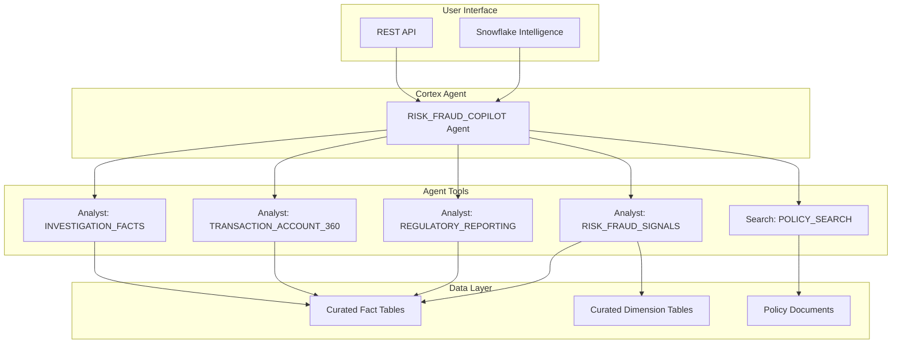

# Build the Risk & Fraud Copilot Cortex Agent

## Context

The platform has 4 semantic views (RISK_FRAUD_SIGNALS, REGULATORY_REPORTING, TRANSACTION_ACCOUNT_360, INVESTIGATION_FACTS) in RISK_DB.SEMANTICS, plus 6 parsed policy documents in REF_POLICY_DOCUMENTS. The account is on AWS_AP_SOUTHEAST_1 (Singapore).

The agent needs two capabilities:
1. **Analyst tool** -- query structured data via semantic views (transactions, customers, loans, deposits)
2. **Search tool** -- retrieve policy text as evidence for compliance questions

## Architecture

## Implementation Steps

### Step 1: Create a Cortex Search Service on Policy Documents
Create a search service over REF_POLICY_DOCUMENTS so the agent can retrieve relevant policy sections when answering compliance questions. This requires a table with a text column for the search corpus.

### Step 2: Create the Cortex Agent
Use CREATE CORTEX AGENT to wire together:
- 4 Analyst tools (one per semantic view) for data queries
- 1 Search tool for policy document retrieval
- Agent instructions that guide it to combine data evidence with policy citations

### Step 3: Test the Agent
Run test queries through the agent to validate it can:
- Answer data questions (AML alerts, risk scores, loan health)
- Cite policy documents as evidence
- Combine both into investigation-style responses

### Step 4: Verify End-to-End Flow
Test the "signal to evidence to finding" flow:
1. Signal: "Show me structuring alerts"
2. Evidence: "What does our AML policy say about structuring?"
3. Finding: "Generate an investigation summary for the top flagged customer"

## Verification
- Agent responds to plain-English data questions with correct numbers
- Agent retrieves relevant policy sections when asked about compliance rules
- Agent can combine data + policy into an investigation narrative
- Agent is accessible in Snowflake Intelligence

## Critical Files
- `RISK_DB.SEMANTICS.*` -- The 4 semantic views that power the Analyst tools
- `RISK_DB.CURATED.REF_POLICY_DOCUMENTS` -- Policy text for the Search service
