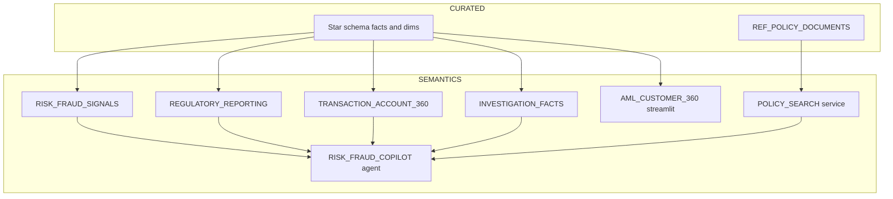

## Context

Verified current state on **QBGIWTU-DK32675**:
- Governed data layer complete: 4 semantic views live, star schema populated, 1000 transactions / 100 AML-flagged.
- `SHOW CORTEX SEARCH SERVICES`, `SHOW AGENTS`, `SHOW STREAMLITS` in account all return **zero rows** — the entire consumption layer is missing.
- Region is `AWS_AP_SOUTHEAST_1`, the same region where the Search Service + Agent were successfully built on the earlier trial account, so no feature-availability risk.
- Connection `qbgiwtu-dk32675` already exists in `connections.toml` (OAuth auth code).
- Local `.venv` has snowpark 1.54.0 and streamlit 1.62.0 (a pyarrow-version warning is emitted but imports succeed).

Two findings that shape the plan:

**1. `CLASSIFICATION` is empty for all 6 policy documents.** The parse regex in [raw/procedures/sp_load_raw_data.sql](raw/procedures/sp_load_raw_data.sql) looks for `'Classification: ([A-Z]+)'`, but the PDFs generated by [raw/procedures/sp_generate_risk_data.sql](raw/procedures/sp_generate_risk_data.sql) never emit that line. So the Search Service should index `POLICY_NAME` as its only attribute — adding `CLASSIFICATION` (as the earlier account did) creates a filter facet where every value is NULL.

**2. The policy documents are extremely thin — 133 to 176 characters each.** For example the entire AML policy body is `## Purpose Prevents ML/TF. ## Screening OFAC/UN/EU/UK. Threshold: 85%.` The agent's policy citations will be one-line fragments, which undercuts the "Evidence" half of the Signal -> Evidence -> Finding story that the whole solution is premised on. Step 2 below enriches the generator to emit substantive policies. This is the one judgment call in the plan and is fully separable — say the word and I will skip it and index the existing text as-is.

**No `snow` CLI and no `cortex` CLI on this machine**, so Streamlit-in-Snowflake deployment goes through a short Snowpark script that PUTs the app files to a stage, followed by `CREATE STREAMLIT ... FROM @stage`.

### Target architecture



## Implementation steps

1. **Create the Cortex Search Service.** `USE SCHEMA RISK_DB.SEMANTICS` first (the `ON` clause takes a *column* name, not a table reference — a fully-qualified table in `ON` fails with `unexpected '.'`), then:
   ```sql
   CREATE OR REPLACE CORTEX SEARCH SERVICE POLICY_SEARCH
     ON FULL_CONTENT
     ATTRIBUTES POLICY_NAME
     WAREHOUSE = COMPUTE_WH
     TARGET_LAG = '1 hour'
     AS (SELECT POLICY_ID, POLICY_NAME, FULL_CONTENT
         FROM RISK_DB.CURATED.REF_POLICY_DOCUMENTS);
   ```
   Poll `SHOW CORTEX SEARCH SERVICES` until indexing state is ACTIVE.

2. **(Optional, recommended) Enrich the policy documents.** Edit the `POLICIES` dict in [raw/procedures/sp_generate_risk_data.sql](raw/procedures/sp_generate_risk_data.sql) so each of the 6 policies emits several paragraphs with concrete thresholds, escalation procedures, and regulatory references — and add the `Classification: INTERNAL` line the loader's regex already expects. Redeploy the procedure, regenerate, `ALTER STAGE ... REFRESH` both stages, reload RAW, refresh the curated layer. The Search Service picks up new content automatically on its target lag. Skip this step to move faster with the current one-line policies.

3. **Create the Cortex Agent** `RISK_DB.SEMANTICS.RISK_FRAUD_COPILOT` via `CREATE OR REPLACE AGENT ... FROM SPECIFICATION $$ <json> $$` (use the plain `$$` delimiter — the labelled `$spec$` form fails to parse). Five tools: four `cortex_analyst_text_to_sql` tools, one per semantic view, plus one `cortex_search` tool over `POLICY_SEARCH`. Orchestration instructions encode the Signal -> Evidence -> Finding workflow: identify the signal from transaction/loan facts, pull supporting evidence from the relevant semantic view, cite the governing policy from search, then state the finding.

4. **Codify both in the repo.** Add `semantics/policy_search.sql` and `semantics/risk_fraud_copilot.agent.sql` holding the exact DDL, register them in [scripts/deploy.sql](scripts/deploy.sql) as sections 12-13, and extend [.cortex/skills/setup/SKILL.md](.cortex/skills/setup/SKILL.md) with the matching steps. These objects existed only as ad-hoc SQL on the previous account, which is precisely why they were lost in the account move.

5. **Make [streamlit_app.py](streamlit_app.py) dual-mode.** Replace the hardcoded `connection_name="hmxhrph-kh35929"` with a helper that prefers `get_active_session()` (so it works unchanged inside Snowflake) and falls back to `snowflake.connector.connect(connection_name="qbgiwtu-dk32675", ...)` for local runs. Rework `run_query` to use the session when present and a cursor otherwise. Keep every page, filter, KPI, and chart as-is.

6. **Deploy as Streamlit-in-Snowflake.** Add an `environment.yml` declaring `streamlit`, `snowflake-snowpark-python`, and `pandas` for the warehouse runtime. Create `RISK_DB.SEMANTICS.STREAMLIT_STAGE`, PUT `streamlit_app.py` + `environment.yml` to it via a short Snowpark script run from the local `.venv`, then:
   ```sql
   CREATE OR REPLACE STREAMLIT RISK_DB.SEMANTICS.AML_CUSTOMER_360
     FROM '@RISK_DB.SEMANTICS.STREAMLIT_STAGE'
     MAIN_FILE = 'streamlit_app.py'
     QUERY_WAREHOUSE = COMPUTE_WH
     TITLE = 'Risk & Fraud Copilot';
   ALTER STREAMLIT RISK_DB.SEMANTICS.AML_CUSTOMER_360 ADD LIVE VERSION FROM LAST;
   ```
   The `ADD LIVE VERSION FROM LAST` is required — per the CREATE STREAMLIT docs the app is not live after creation until that runs (or the owner opens it in Snowsight).

7. **Verify end-to-end** (detail below), then report the Snowsight paths for both the agent and the app.

## Verification

- `SHOW CORTEX SEARCH SERVICES IN SCHEMA RISK_DB.SEMANTICS` -> `POLICY_SEARCH` with serving and indexing state ACTIVE, 6 rows indexed.
- Direct search probe: `SELECT PARSE_JSON(SNOWFLAKE.CORTEX.SEARCH_PREVIEW('RISK_DB.SEMANTICS.POLICY_SEARCH', '{"query":"structuring threshold","limit":3}'))` returns the Transaction Monitoring policy.
- `DESCRIBE AGENT RISK_DB.SEMANTICS.RISK_FRAUD_COPILOT` -> spec parses, all 5 tools with correct `tool_resources` pointing at real semantic views and the search service.
- `SHOW STREAMLITS IN SCHEMA RISK_DB.SEMANTICS` -> app present with a live version set.
- Local smoke test: `.venv\Scripts\python.exe -m streamlit run streamlit_app.py --server.port 8505` renders both pages against this account (confirms the fallback path still works after the refactor).
- Honest limitation to flag up front: the agent cannot be invoked from SQL — there is no `INVOKE_AGENT` function and `<agent>!RUN(...)` does not exist. Configuration correctness is verifiable by me; the actual conversational round-trip has to be exercised by you in Snowsight under AI & ML > Agents. I will hand over a set of test questions spanning signal, evidence, finding, regulatory, and combined query types rather than claiming a runtime test I cannot perform.

## Critical Files

- [streamlit_app.py](streamlit_app.py) - connection layer must become dual-mode for SiS; currently hardcoded to the old account
- [raw/procedures/sp_generate_risk_data.sql](raw/procedures/sp_generate_risk_data.sql) - the `POLICIES` dict is the source of the thin policy text and the missing `Classification:` line
- [scripts/deploy.sql](scripts/deploy.sql) - deployment manifest to extend with the search service and agent
- [.cortex/skills/setup/SKILL.md](.cortex/skills/setup/SKILL.md) - project setup skill to extend so a future account move recreates the full stack
- [curated/tables/ref_policy_documents.sql](curated/tables/ref_policy_documents.sql) - the table the Search Service indexes; defines `FULL_CONTENT` and `POLICY_NAME`