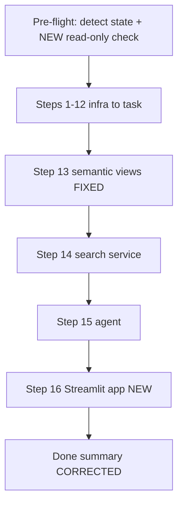

## Context

.cortex/skills/setup/SKILL.md is the project's user-invocable deployment skill (`user_invocable: true`, 15 steps, each with a CHECKPOINT). I used it earlier this session to deploy to account QBGIWTU-DK32675, which is how the defects below surfaced.

Verified problems:

1. **Step 13 cannot succeed (lines 319-348).** Both paths are broken:

   - Line 325 runs `cortex semantic-views deploy --manifest ...`. Confirmed: neither `cortex` nor `snow` CLI is on this machine.
   - Lines 337-343 fall back to `CREATE OR REPLACE SEMANTIC VIEW <target> AS $$ <yaml> $$;`, which is not valid syntax.

   The correct call, confirmed from the docs, is:

   ```sql
   CALL SYSTEM$CREATE_SEMANTIC_VIEW_FROM_YAML('<db>.<schema>', $$ <yaml> $$ [, verify_only] [, create_or_alter]);
   ```

   Critically, "the stored procedure uses the name from the YAML specification for the name of the semantic view" - the first argument is the **schema path only**. The existing file-to-target-object table implies the name is passed in, which is misleading.

   The procedure also accepts `verify_only = TRUE`, which validates a spec without creating anything. The skill has no validation step today, so this is a genuine improvement rather than just a repair.

2. **The update path repeats the same bad syntax.** Line 60 says "Semantic views via `CREATE OR REPLACE SEMANTIC VIEW`".

3. **No Streamlit deployment step.** scripts/deploy\_streamlit.py exists and is what I have been running manually, but `/setup` never calls it, so a fresh install produces data and AI layers with no UI.

4. **Dead CLI example in Ongoing Operations (line 406):** `cortex analyst query ... --view=`.

5. **"Done" section is stale (lines 387-391):** claims 8 raw tables (there are 9), and omits the search service, agent, and Streamlit app.

6. **The read-only session-scope trap is undocumented.** With CoCo's read-only toggle on, every DDL fails with `Restricted session scope: USER SPECIFIED does not include CREATE ... access`. This blocked the deployment twice this session and has no SQL workaround. Pre-flight should state it.



## Implementation steps

1. **Add a read-only pre-flight check** to the Pre-flight section. State that the CoCo read-only toggle must be off, quote the exact error text so it is recognisable, and note the diagnostic `SELECT SYS_CONTEXT('SNOWFLAKE$SESSION','ACTIVE_RESTRICTED_SESSION_SCOPES')`.

2. **Rewrite Step 13.** Replace the CLI primary path and the invalid DDL fallback with `SYSTEM$CREATE_SEMANTIC_VIEW_FROM_YAML`. Structure it as: read each of the 4 `semantics/*.sv.yaml` files, optionally validate with `verify_only => TRUE`, then create. Explain that the name comes from the YAML and the first argument is `RISK_DB.SEMANTICS`. Keep the file-to-object table but relabel it as the expected result rather than an input mapping. Retain the existing CHECKPOINT.

3. **Fix the update path (line 60)** to point at Step 13's approach instead of `CREATE OR REPLACE SEMANTIC VIEW`.

4. **Add Step 16: Deploy the Streamlit app.** Run `.venv\Scripts\python.exe scripts\deploy_streamlit.py`, which PUTs `streamlit_app.py` and `environment.yml` to `RISK_DB.SEMANTICS.STREAMLIT_STAGE`, creates `AML_CUSTOMER_360`, and adds a live version. CHECKPOINT: `SHOW STREAMLITS IN SCHEMA RISK_DB.SEMANTICS` returns `AML_CUSTOMER_360`. Note that `environment.yml` must include `altair`, since the app imports it at module level.

5. **Replace the dead CLI example (line 406)** with working ways to query: Snowsight AI and ML Agents for the full agent, or the app's Ask the Copilot page, or `SNOWFLAKE.CORTEX.SEARCH_PREVIEW` for policy lookups.

6. **Correct the "Done" summary:** 9 raw tables, and add the SEMANTICS-layer additions (POLICY\_SEARCH search service, RISK\_FRAUD\_COPILOT agent, AML\_CUSTOMER\_360 Streamlit app).

## Verification

Static checks (the skill is markdown, so there is no compiler):

- Re-grep headings to confirm Step 16 exists and ordering is intact.
- Confirm no remaining occurrences of `CREATE OR REPLACE SEMANTIC VIEW` or `cortex semantic-views deploy` / `cortex analyst query` anywhere in the file.
- Confirm the raw-table count in the Done section matches `raw/tables/` (9).

Behavioural check on the one risky instruction, without mutating anything:

- Validate the corrected Step 13 call using the documented dry-run on a single view:
  ```sql
  CALL SYSTEM$CREATE_SEMANTIC_VIEW_FROM_YAML('RISK_DB.SEMANTICS', $$ <risk_fraud_signals.sv.yaml contents> $$, TRUE);
  ```
  Expect "YAML file is valid for creating a semantic view. No object has been created yet." This proves the replacement syntax works against the project's real YAML before anyone relies on it. Requires the read-only toggle off; if it is on, this check is deferred and I will say so rather than claim it passed.

Not re-run: the full 16-step deployment, since the environment is already deployed and a fresh run would be destructive. I will state clearly that end-to-end execution on a clean account remains unverified.

## Critical Files

- .cortex/skills/setup/SKILL.md - the only file being edited; all six changes land here
- scripts/deploy\_streamlit.py - the command new Step 16 wraps
- semantics/risk-fraud-copilot.yaml - artifact manifest listing the 4 views and their target objects, used to write Step 13 accurately
- environment.yml - must contain altair; referenced by the new Step 16 note
