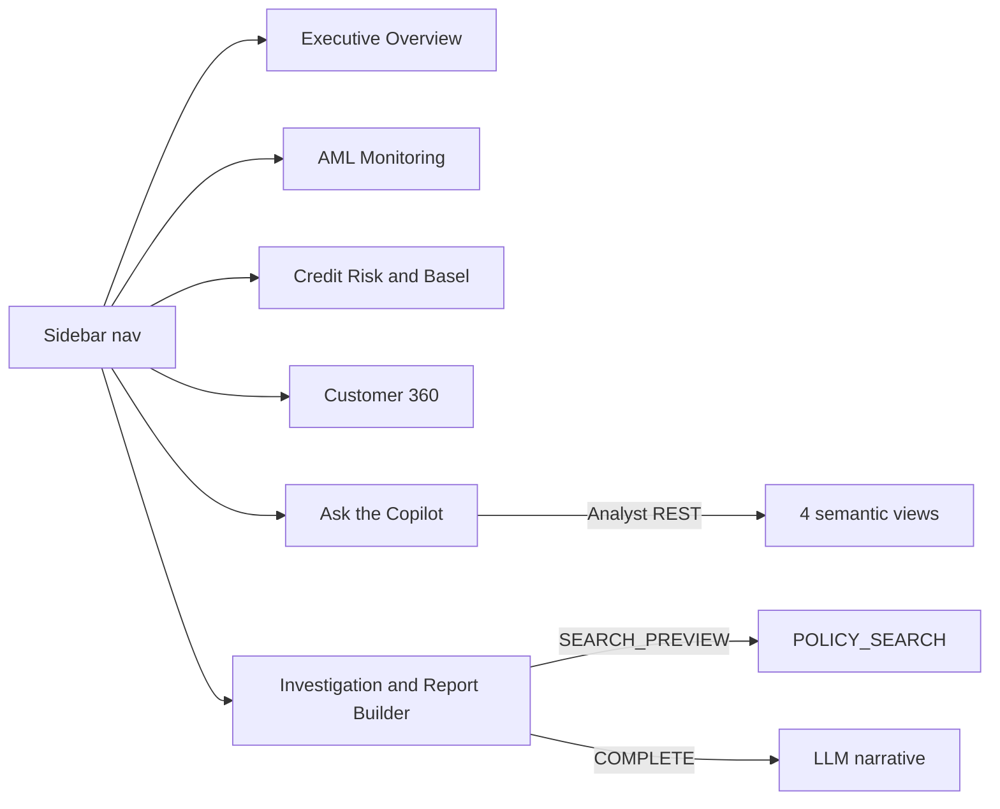

## Context

Current [streamlit_app.py](streamlit_app.py) is a single file, dual-mode (active session in SiS, `snowflake.connector` locally), with a sidebar `radio` nav and two pages (AML Monitoring, Customer 360). All data access goes through one `run_query(sql)` helper. The deployed SiS app is `RISK_DB.SEMANTICS.AML_CUSTOMER_360` on the warehouse runtime.

Chosen scope (4 additions): Executive Risk Overview, Ask the Copilot, Credit Risk & Basel, Investigation & Report Builder.

### Key technical findings from docs

1. **Cortex Agents API cannot be called from a warehouse-runtime SiS app.** So "Ask the Copilot" will use the **Cortex Analyst REST API** (`/api/v2/cortex/analyst/message`), which is fully supported from SiS and now accepts a `semantic_view` directly. This still delivers governed NL to SQL with the generated SQL shown for explainability. Trade-off vs the agent: one semantic view per call, so the page has a domain selector (Fraud/Regulatory/360/Investigation) mapping to our 4 views. The full multi-tool agent remains available in Snowsight.
2. **In-SiS auth** uses `_snowflake.send_snow_api_request("POST", endpoint, {}, {}, body, {}, timeout)` — no PAT needed; the app's own session authorizes. This is the pattern in Snowflake's official Analyst SiS example.
3. **`SNOWFLAKE.CORTEX.SEARCH_PREVIEW` and `SNOWFLAKE.CORTEX.COMPLETE` are SQL functions** callable through the existing `run_query()` in SiS. The Report Builder uses `SEARCH_PREVIEW` over `POLICY_SEARCH` for the policy citation and `COMPLETE` to draft the finding narrative from assembled facts. No REST needed for those.
4. Local-run caveat: `_snowflake` is only available inside SiS. Ask-the-Copilot will detect its absence and show a notice locally; the other 5 pages stay fully dual-mode.

## Implementation steps

1. **Nav + shared helpers.** Extend the sidebar `radio` to the 6 pages, ordering Executive Overview first. Add three helpers next to `run_query`: `run_analyst(question, semantic_view)` (calls `_snowflake.send_snow_api_request`, parses the `message.content` for the `sql` + `text`, runs the SQL via `run_query`, returns interpretation + dataframe); `cortex_complete(prompt, model='claude-sonnet-4-5')` and `search_policies(query, limit)` (both thin `run_query` wrappers over the SQL functions). Guard `run_analyst` so a missing `_snowflake` module shows a graceful local-mode message.

2. **Executive Risk Overview (landing).** Cross-domain KPI tiles: flagged transactions + flagged amount (FCT_TRANSACTION), total RWA + total capital requirement + Basel-violation loan count (DIM_LOAN), total ECL + Stage 3 count (FCT_LOAN_PERFORMANCE), high-risk customers and liquidity-violation deposits. Two headline charts: alerts by type, and IFRS9 stage ECL. A short "how to use this app" caption pointing to the copilot.

3. **Credit Risk & Basel page.** Pure SQL over `REGULATORY_REPORTING`'s base tables. KPIs (total RWA, capital requirement, total ECL, avg PD of violation loans). Charts: RWA by ASSET_CLASS, capital by BASEL_APPROACH, IFRS9 stage distribution with summed ECL, delinquency-status counts. Tables: top-10 exposures by RWA, and the Basel-violation loans with PD/LGD/LTV. Sidebar note that filters on this page are independent of the AML alert filters.

4. **Ask the Copilot page.** Domain selectbox -> semantic view. A `st.chat_input`/text box; on submit call `run_analyst`. Render: the natural-language interpretation, an expander with the generated SQL (explainability), and the result as a dataframe + auto chart when shape allows. Show a few example questions per domain. Persist Q&A in `st.session_state` for a simple transcript. Prominent caption: "Full multi-tool agent (RISK_FRAUD_COPILOT) is available in Snowsight; this page queries one domain at a time."

5. **Investigation & Report Builder page.** Customer selector (reuse Customer 360 query). Assemble the three stages: SIGNAL (their flagged transactions, alert types, max risk score), EVIDENCE (profile: KYC/PEP/sanctions/risk rating; accounts; top flagged transactions; any delinquent loans/ECL), POLICY (call `search_policies` with a query built from their dominant alert type, e.g. "structuring" -> Transaction Monitoring Policy, show cited policy name + excerpt). Then a "Generate finding" button calls `cortex_complete` with a structured prompt containing the assembled facts to draft a SAR-style narrative. Render the full document and offer `st.download_button` to export it as Markdown. This is the signal->evidence->finding closure the brief asks for.

6. **Redeploy + register.** Run `scripts/deploy_streamlit.py` to push the updated app and add a live version. No new Snowflake objects are required (search service, semantic views, warehouse already exist). Commit on a feature branch.

## Verification

- Local smoke test: `.venv\Scripts\python.exe -m streamlit run streamlit_app.py --server.port 8505` — all 6 pages render; Executive, AML, Credit, Customer 360, and Report Builder work fully; Ask-the-Copilot shows the graceful local-mode notice.
- SiS test after redeploy (Snowsight -> Projects -> Streamlit -> Risk & Fraud Copilot):
  - Ask the Copilot: "Which customers have the highest flagged transaction amounts?" against the Fraud domain returns interpretation + SQL + rows.
  - Report Builder: pick the top flagged customer, confirm SIGNAL/EVIDENCE/POLICY populate, generate the finding, download the .md.
  - Credit & Basel: KPIs are non-zero, IFRS9 chart shows 3 stages, violation table shows ~10 loans.
- Read-only SQL spot-checks for each page's queries via `snowflake_sql_execute` before wiring them in, so no page ships with a broken query.

## Critical Files

- [streamlit_app.py](streamlit_app.py) - all four pages, the nav, and the three new Cortex helpers land here
- [scripts/deploy_streamlit.py](scripts/deploy_streamlit.py) - redeploys the updated app to SiS
- [semantics/regulatory_reporting.sv.yaml](semantics/regulatory_reporting.sv.yaml) - column reference for the Credit & Basel page and the Analyst "Regulatory" domain
- [semantics/investigation_facts.sv.yaml](semantics/investigation_facts.sv.yaml) - backs the Report Builder and the Analyst "Investigation" domain
- [curated/tables/ref_policy_documents.sql](curated/tables/ref_policy_documents.sql) - the policy text the Report Builder cites via POLICY_SEARCH